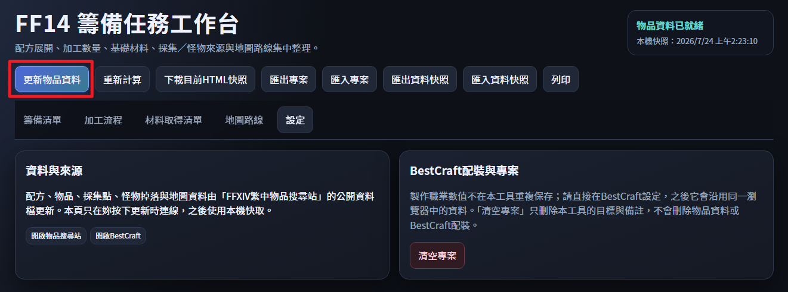
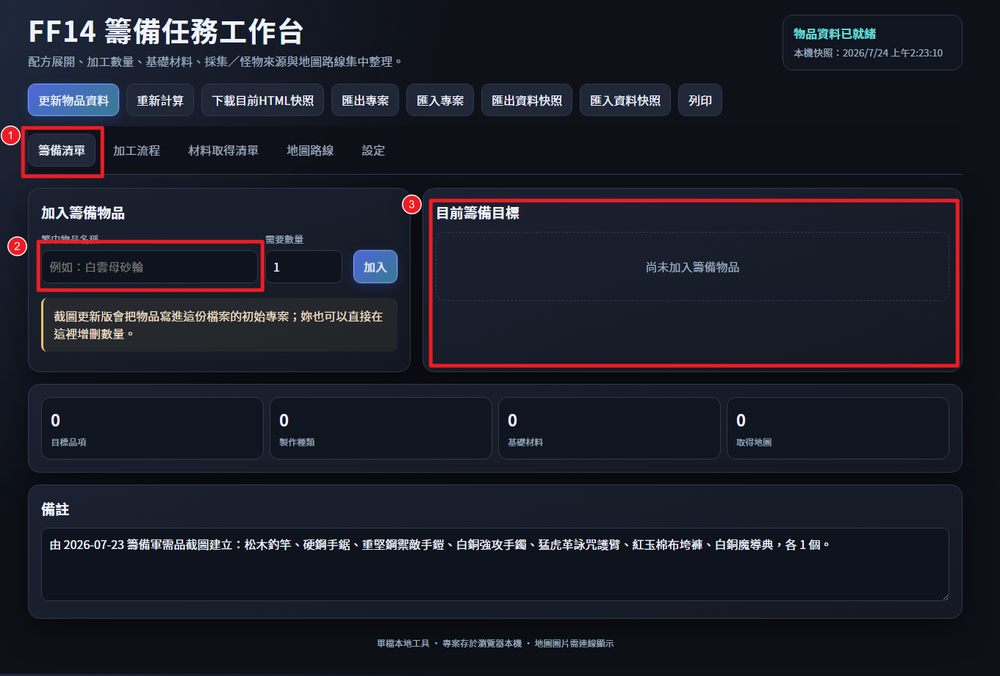
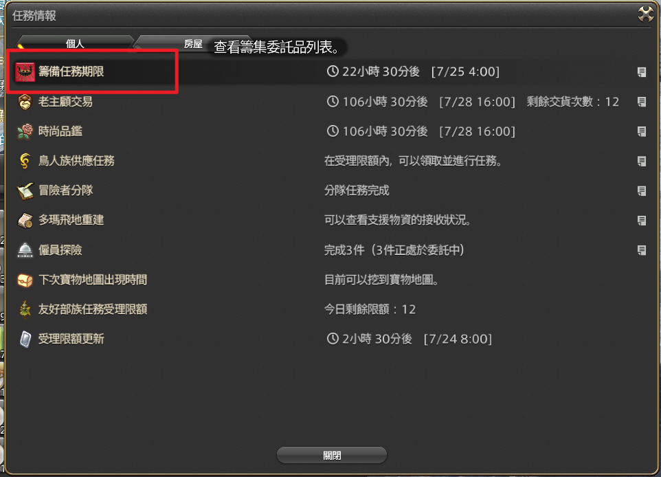
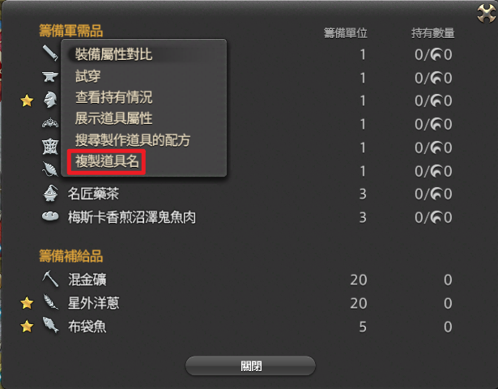
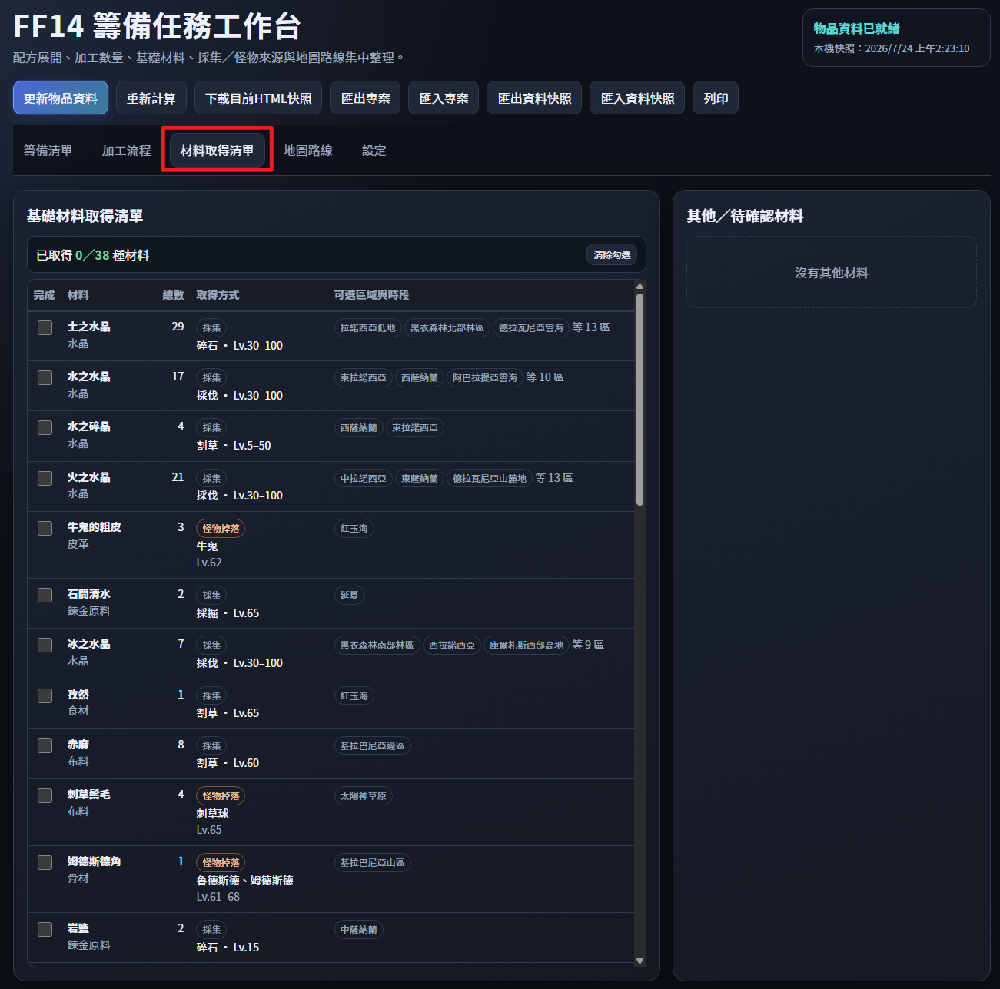
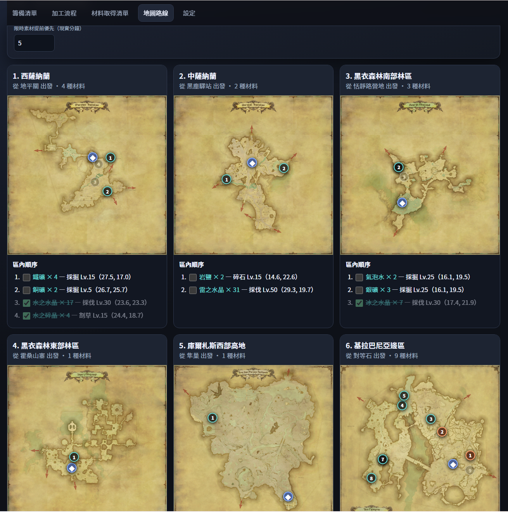
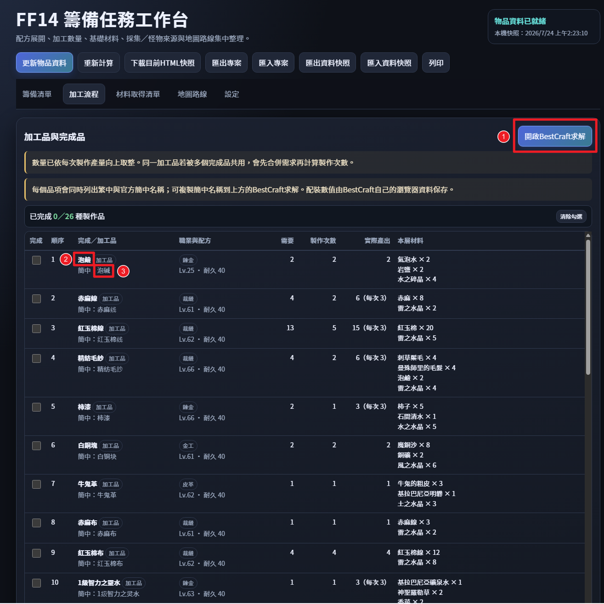

# FF14 籌備任務工作檯 使用說明

1. 打開資料夾中的 FF14 籌備任務工作台.html 檔案

   > 推薦存進最愛或書籤列

2. 打開網頁檔後，點擊「更新物品資料」（如圖）

3. 建立籌備清單

   1. 點擊「籌備清單」

   2. 在遊戲內按Ctrl+U打開任務情報視窗，點擊「籌備任務期限」打開軍需品視窗，右鍵點擊你要製作的籌備品，選擇「複製道具名」，回到網頁在加入籌備物品的地方貼上。（當然你也可以手動打字XD）

      > 採集和釣魚也可以加入喔~ 這樣地圖路線會一起顯示整體最佳採集路線

   3. 加入後可以從右邊的「目前籌備目標」區塊，看到準備製作的道具清單。

   

   

   

4. 「材料取得清單」可以快速閱覽包含加工品與完成品究竟需要哪些材料，不需要特別採集的水晶可以先全部打勾。

   

5. 接著來到「地圖路線」。因為作者個人習慣緣故，基本上都是從海都出發，所以整個地圖路線的設計是從海都開始一路採集能夠最省傳送費。有限時材料的情況，會在材料出現的實際時間5分鐘前跑道最上面。全部材料都已採集並被勾選的地圖則會掉到最下面。

   

6. 採集完成後就可以進入「加工流程」了

   1. 先從右上角打開BestCraft的巨集求解頁面。記得要先到配裝頁輸入自己的遊戲實際狀態參數喔！
   2. 接著複製你要製作的物品的繁體中文，貼到遊戲中的製作筆記左上角的搜尋框
   3. 再複製簡體中文，貼到BestCraft配方頁面上方的搜尋欄，找到配方後點擊配方名稱，跳出的視窗右下角按確認
   4. 進入求解頁面按開始求解，然後到匯出頁面點擊複製巨集
   5. 再進入遊戲中的巨集管理介面，建立/修改你的製作巨集

   

7. 開始製作，敲敲敲。把加工流程頁面的東西都敲完就結束囉(`・ω・´)！

